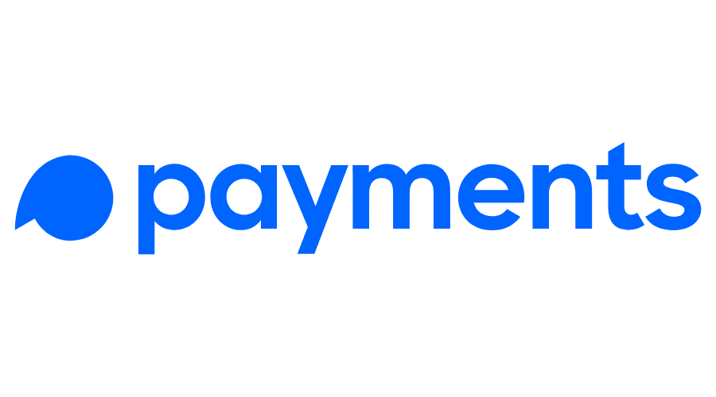

# 🏦 LIST PAYMENT



**LIST PAYMENT** adalah aplikasi web sederhana yang dirancang untuk memfasilitasi berbagai metode pembayaran. Proyek ini menyediakan antarmuka yang ramah pengguna untuk melakukan transaksi menggunakan platform pembayaran populer.

---

## 🚀 Fitur Utama

- ✅ **Daftar Metode Pembayaran**: Termasuk Dana, Gopay, OVO, ShopeePay, Bank Jago, SeaBank, dan NeoBank.
- 📱 **Kode QRIS**: Memudahkan proses pembayaran.
- 📥 **Unduh Kode QRIS**: Dapat diunduh untuk transaksi.
- 💻 **Desain Responsif**: Optimal untuk pengguna mobile dan desktop.

---

## 📦 Instalasi

Untuk menjalankan proyek ini secara lokal, ikuti langkah-langkah berikut:

1. **Clone repositori**:
   ```bash
   git clone https://github.com/aetherzcode/my-payment.git
   ```

2. **Masuk ke direktori proyek**:
   ```bash
   cd my-payment
   ```

3. **Buka `index.html` di browser Anda**.

---

## 🛠️ Penggunaan

Cukup buka file `index.html` di browser Anda untuk mengakses aplikasi. Anda dapat mengklik metode pembayaran untuk melihat informasi lebih lanjut dan mengunduh kode QRIS.

---

## 🤝 Kontribusi

Kontribusi sangat diterima! Jika Anda memiliki saran untuk perbaikan atau fitur baru, silakan buka isu atau kirimkan permintaan tarik (pull request).

---

## 📜 Lisensi

Proyek ini dilisensikan di bawah **Lisensi MIT**. Lihat file [LICENSE](LICENSE) untuk detailnya.

---

## 👤 CREATOR

- **Nama**: AETHER
- **Email**: [aetherscode@gmail.com](mailto:aetherscode@gmail.com)
- **GitHub**: [aetherzcode](https://github.com/aetherzcode)
- **Website**: [aetherz.xyz](https://aetherz.xyz)

---